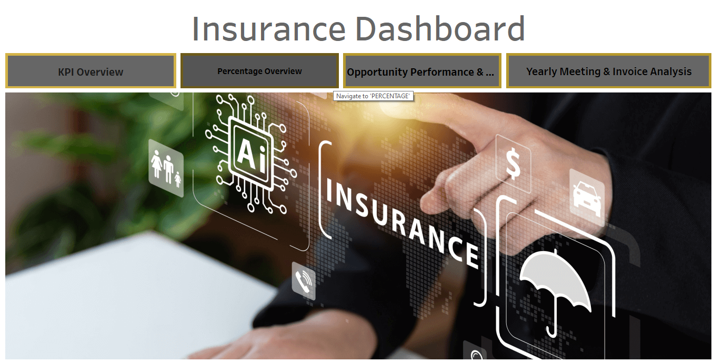

# 🛡️ Insurance Data Analysis Dashboard

## 📌 Project Overview
This project is an end-to-end **Insurance Data Analysis Dashboard** developed to analyze insurance business performance. The project uses **Excel, Power BI, Tableau, and SQL** to clean, analyze, visualize, and present insurance data in an interactive dashboard format.

The dashboard helps users understand important business metrics such as total premium amount, total claim amount, policy count, customer details, policy categories, and claim status.

## 🎯 Objectives
- 📊 Analyze insurance policy data
- 💰 Track premium and claim amounts
- 👥 Understand customer and policy trends
- 📂 Compare different policy categories
- 🔍 Identify claim status and business performance
- 📈 Create interactive dashboards for decision-making

## 🛠️ Tools and Technologies Used
- 📗 **Microsoft Excel** – Data cleaning, analysis, and dashboard creation
- 📊 **Power BI** – Interactive dashboard and data visualization
- 📉 **Tableau** – Dashboard creation and visual analysis
- 🗃️ **SQL** – Data querying and analysis
- 💻 **GitHub** – Project documentation and version control

## 📁 Dataset Details
The dataset contains insurance-related information such as:

- 🔢 Policy Number
- 👤 Customer Name
- 🚻 Gender
- 🎂 Age
- 📋 Policy Type
- 💵 Premium Amount
- 💸 Claim Amount
- ✅ Claim Status
- 📅 Policy Start Date
- 📅 Policy End Date
- 📍 Customer Location
- 🏷️ Insurance Category

## 📌 Key Performance Indicators (KPIs)
The dashboard includes the following KPIs:

- 📄 Total Number of Policies
- 💰 Total Premium Amount
- 💸 Total Claim Amount
- 👥 Total Customers
- 🟢 Active Policies
- 🔴 Closed Policies
- 🟡 Pending Claims
- ✅ Claim Approval Status

## ✨ Dashboard Features
- 🎛️ Interactive filters and slicers
- 📊 Policy category analysis
- 💰 Premium amount analysis
- 💸 Claim amount analysis
- 👥 Customer demographic analysis
- 🚻 Gender-wise policy analysis
- 🏷️ Insurance category comparison
- 📌 Claim status tracking
- 📈 Trend analysis using charts and graphs

## 🔎 Analysis Performed
- 📊 Compared premium amount by policy type
- 💸 Analyzed claim amount by insurance category
- 📋 Identified active, closed, and pending policies
- 👥 Analyzed customers based on gender and age group
- 📈 Created visual reports for business decision-making
- 🗃️ Used SQL queries to extract and analyze insurance data
- 📊 Built dashboards in Excel, Power BI, and Tableau

## 📂 Files Included

| File Name | Description |
|---|---|
| `Insurance-Excel-Dashboard.xlsx` | 📗 Excel dashboard and analysis |
| `Insurance-Power BI-Dashboard.pbix` | 📊 Power BI interactive dashboard |
| `Insurance-Tableau-Dashboard.twbx` | 📉 Tableau dashboard |
| `Insurance-SQL Query.sql` | 🗃️ SQL queries used for data analysis |
| `Insurance-Excel-File.zip` | 📦 Excel source files |
| `Insurance-Tableau-Screenshot.png` | 🖼️ Tableau dashboard screenshot |

## 🖼️ Dashboard Screenshots

### 📉 Tableau Dashboard

## 💡 Skills Demonstrated
- 🧹 Data Cleaning
- 🔎 Data Analysis
- 📊 Data Visualization
- 📈 Dashboard Development
- 📗 Excel Functions
- 📊 Power BI
- 📉 Tableau
- 🗃️ SQL Queries
- 💼 Business Analysis
- 📌 KPI Reporting

## 📝 Conclusion
This project demonstrates how insurance data can be transformed into meaningful business insights using Excel, Power BI, Tableau, and SQL. The dashboards provide a clear view of insurance performance and help in making data-driven business decisions.

## 👩‍💻 Author
**Durga Sonwani**  
Aspiring Data Analyst
